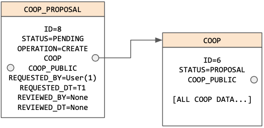
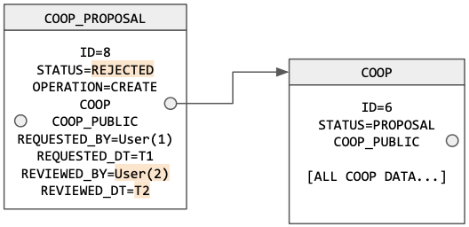
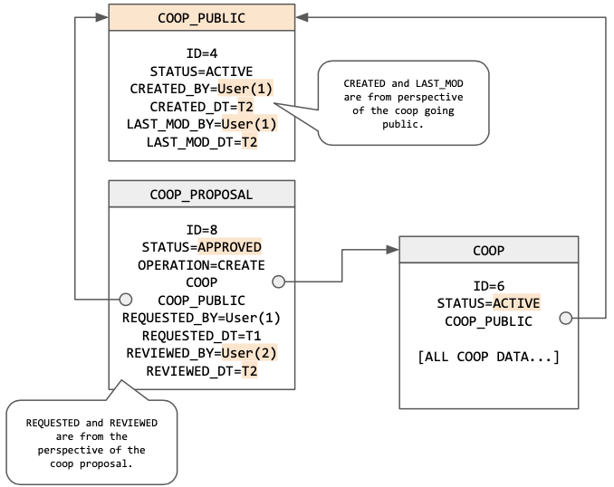
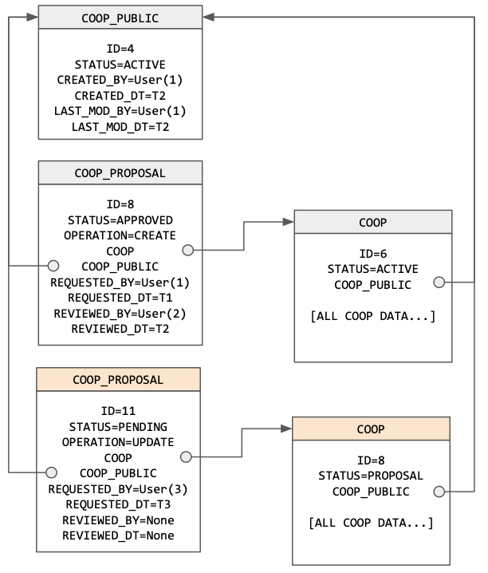
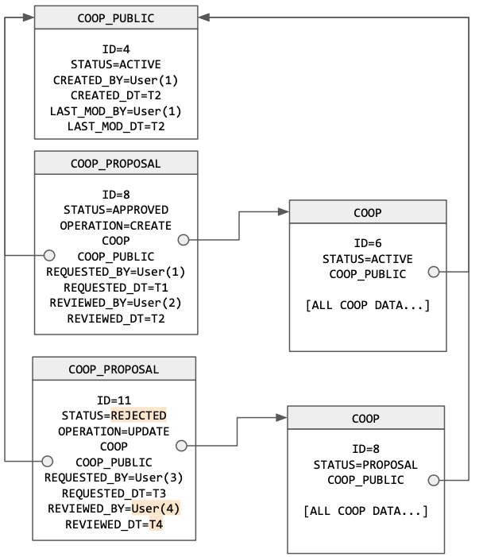
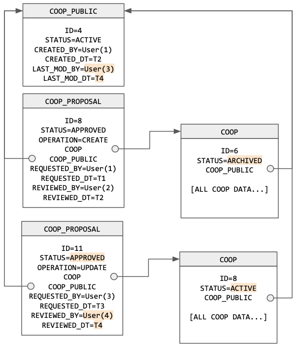
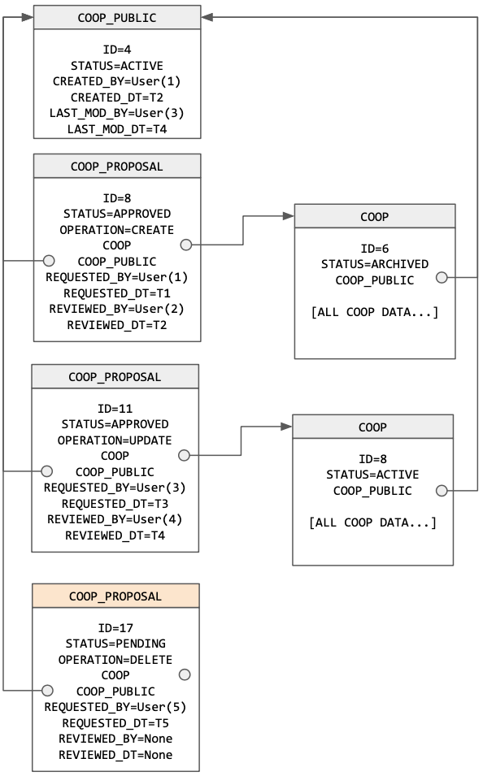
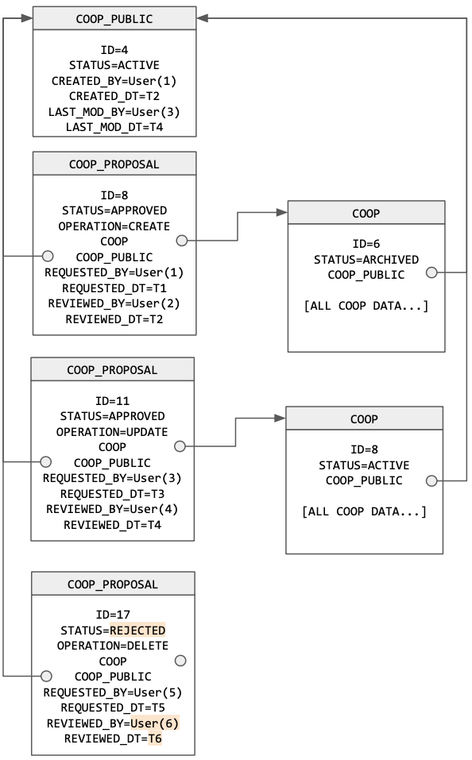
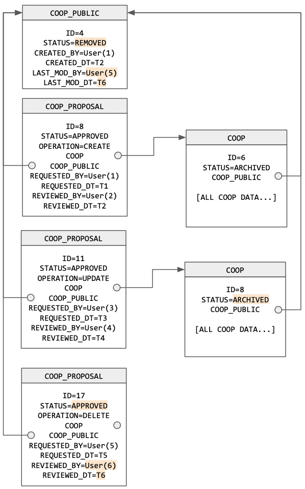

# `web/` - Django Backend

## Coop Proposal to Public Workflow
**TL;DR**: New coops or changes to existing coops are submitted as "proposals" by any authenticated user. Proposals are reviewed and either rejected or approved (and, in turn, made "public") by site administrators.

### Endpoints
| Endpoint | HTTP Verbs | Permission | Description |
| -------- | ---------- | ---------- | ----------- |
| `coops/` | `GET` | `AllowAny` | Returns list of all public coops. |
| `coops/<public_id>/` | `GET` | `AllowAny` |  Returns an individual public coop. |
| `coops/proposal/` | `GET` | `IsAdminUser` | Lists all `CoopProposal`. |
| `coops/proposal/<proposal_id>/` | `GET` | `IsAdminUser` | Returns an individual `CoopProposal`. |
| `coops/proposal/create/` | `POST` | `IsAuthenticated` | Creates new `CoopProposal`. |
| `coops/proposal/review/<proposal_id>/` | `PATCH` | `IsAdminUser` | Reviews a `CoopProposal` and applies changes if `APPROVED`. |

### Data Structure
Three Django models are used for this process.
* `CoopProposal`: Tracks information on proposals, whether or not they have been reviewed, and the related users. 
  * Maps one-to-one to a `Coop` object. 
  * Acts as a historical index to all changes (i.e. approved proposals) and rejected proposals.
  * Statuses:
    * `PENDING`: Proposal has not been reviewed. 
    * `APPROVED`: Reviewed and proposed change has been made public. 
    * `REJECTED`: Reviewed. No changes made. 
* `CoopPublic`: Tracks information on coops that have been made public. Acts as a "master record" or index to all public coops. 
  * Both `CoopProposal` and `Coop` are linked one-to-one to `CoopPublic` to tie together changes made to the same coop. 
  * Statuses:
    * `ACTIVE`: Coop is live and public. Will be returned to users in queries. 
    * `REMOVED`: Coop has been "deleted". We hide this coop from the end user, but maintain it in the database for historical integrity. 
* `Coop`: Contains information on the Coop.
  * Statuses:
    * `ACTIVE`: Current version of Coop data presented to users. Only one `Coop` instance will be active for each `CoopPublic` instance.
    * `PROPOSAL`: Proposed change that has not been reviewed. 
    * `ARCHIVED`: Previously approved version of Coop that has been superseeded by a new version. 


### Example Scripts
`coops/proposal/create/`
| Operation | Description | Example Scripts | 
| --------- | --------- | ----------------------- | 
| `CREATE`  | Create Proposal to Create New Coop | [test_coopproposal_create.sh](./scripts/test_coopproposal_create.sh)  | 
| `UPDATE`  | Create Proposal to Update Existing Coop | [test_coopproposal_update.sh](./scripts/test_coopproposal_update.sh) | 
| `DELETE`  | Create Proposal to Delete Existing Coop | [test_coopproposal_delete.sh](./scripts/test_coopproposal_delete.sh) |

`coops/proposal/review/<proposal_id>/`
| Operation | Description | Example Scripts | 
| --------- | --------- | ----------------------- | 
| `REVIEW`  | Review coop proposal. | [test_coopproposal_review.sh](./scripts/test_coopproposal_review.sh)  | 

### Data Flow
| Operation | Step 1: Create Proposal | Step 2: Proposal Reviewed. Rejected. | Step 2: Proposal Reviewed. Approved. |
| --------- | ----------------------- | ------------------------------------ | ------------------------------------ |
| Create New Coop |  |  |  |
| Update Existing Coop |  |  |  |
| Delete Existing Coop |  |  |  |

## Testing
Tests are stored in the [directory/tests](./directory/tests/) directory using Python's `unittest` framework with additional add-ins from Django and Django Rest Framework. Tests can be run via Django's [manage.py](./manage.py) script. If using Development Mode via Docker, you can access manage.py via `docker exec -it web-dev /bin/bash`. If using Production Mode via Docker, you can access manage.py via `docker exec -it web-prod /bin/bash`.

Run all tests:
```
python manage.py test directory.tests
```

Run all tests in a specific file:
```
python manage.py test directory.tests.[file_name]

Example:
python manage.py test directory.tests.test_coop_list
```

Run all tests in a specific class:
```
python manage.py test directory.tests.[file_name].[class_name]

Example:
python manage.py test directory.tests.test_coop_list.TestCoopList
```

Run a single test:
```
python manage.py test directory.tests.[file_name].[class_name].[test_name]

Example:
python manage.py test directory.tests.test_coop_list.TestCoopList.test_list_all
```

## TODO List
- [x] *Simplify CoopAddressTag Serializer Object Structure
- [x] CoopAddressTag update (serializer)
- [x] Add more Coop -> CoopAddressTag test cases
- [x] Search Coops (views, models)
- [x] Simplify Address Data Structure.
- [x] *Routes for other objects
- [x] Turn on new authentication method (JWT Tokens)
- [x] Create User (views)
- [x] Create User Test cases
- [x] Change Password Workflow
- [x] Enabled filter in coop list (views)
- [x] LocationService: Add coordinates to Address (serializer)
- [x] LocationService: Ratelimit and retry for api.
- [x] Add county to model. Look up and apply from geocode. 
- [x] Coop.patch Proposed Changes (views)
- [x] What should be shown on is_public vs not?
- [x] What to do about spreadsheet?
- [x] Move API to /api/v1/ endpoint.
- [X] Docker Install: PROD vs DEV
- [X] ENV file for PRD
- [x] SMTP Settings: PROD vs DEV
- [x] Confirm `coops/<pk>` is really working off of public_id.
- [x] Confirm `coops/public` is not needed.
- [x] Create endpoint for All proposals for given coop.
- [x] Add data endpoint back in. 
- [x] What is monkey_patching.py?
- [x] Filter out results based on is_public CoopList
  - [x] CoopAddressTags
  - [x] ContactMethod
  - [x] People
  - [x] People -> ContactMethod
- [x] Filter out CoopCSV
- [x] Filter out CoopDetail
- [x] Remove is_filter param from cooplist
- [x] Clean up loose TODOs 
- [ ] What should Coop.scope do? 
- [ ] What should Coop.tags do?
- [ ] HTTPS Certificates
